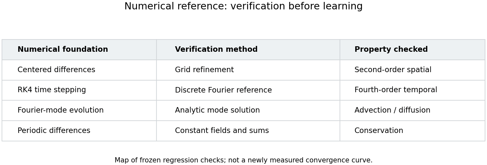
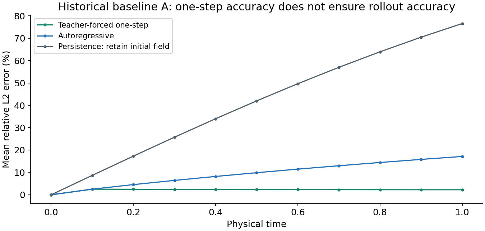
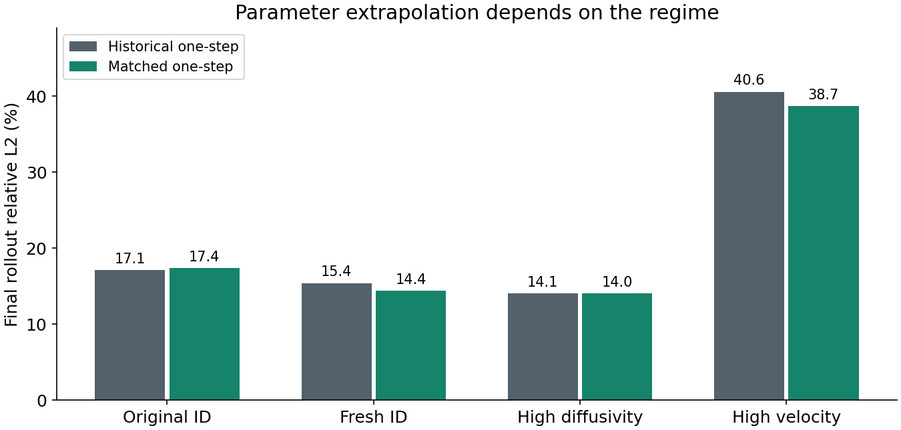
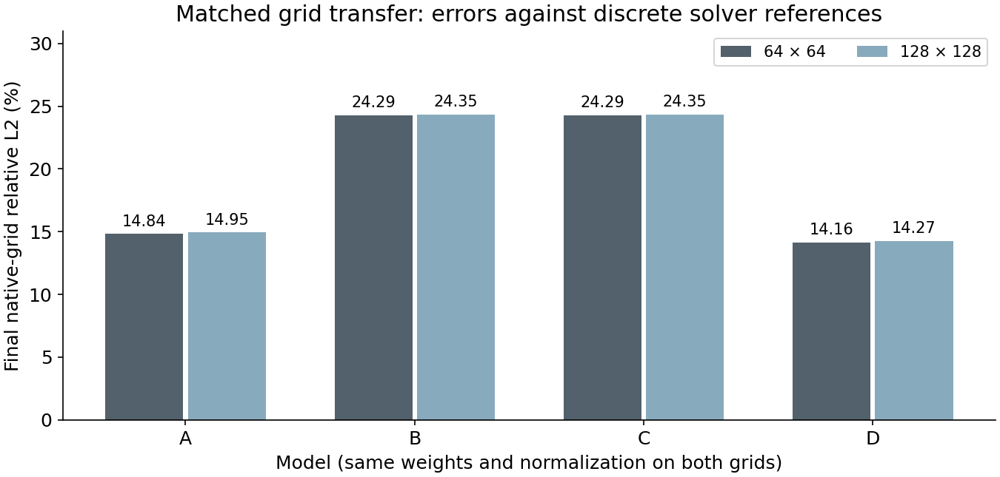
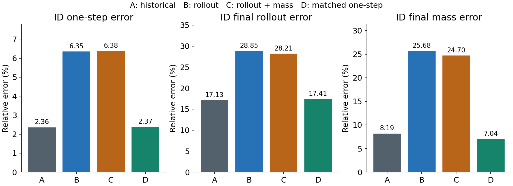

# Learning a periodic PDE operator: accuracy, reliability, and controlled failures

This project connects verified numerical computing with neural-operator learning
for a parameterized two-dimensional advection–diffusion equation. A compact FNO
learns accurate individual steps, but its rollout, extrapolation, physical
validity, and runtime require separate evaluation. Training-objective ablations
underperform; a matched one-step control recovers near-baseline accuracy.

This report synthesizes frozen Stages 1–6. It adds no model, scientific run, or
new conclusion. [Provenance](stage7_provenance.md) identifies the revisions and
source summaries; [reproduction instructions](reproducibility.md) separate public
presentation rebuilds from artifact-dependent historical experiments.

## 1. Problem and reference equation

On `[0,2π)²`, with periodic boundaries and constant coefficients,

```text
∂u/∂t + cx ∂u/∂x + cy ∂u/∂y = nu (∂²u/∂x² + ∂²u/∂y²).
```

The learned map is `(u(t),cx,cy,nu) → u(t+0.1)`. The question is whether a
conditioned operator remains useful beyond one-step interpolation: after
feedback, outside the training coefficient range, under grid refinement, and
when assessed for conservation, positivity, and actual execution cost.

## 2. Verified numerical reference

Second-order centered finite differences use periodic `np.roll` neighbors.
Classical RK4 advances time with a conservative stability-based step bound;
interval endpoints use a shortened final step. The solver does not mutate inputs.

Frozen tests check analytic Fourier-mode evolution, second-order spatial
convergence, fourth-order temporal convergence against a discrete Fourier
reference, constant preservation, periodic mass conservation, and discrete-mode
stability. Comparing temporal error to the semi-discrete solution avoids
confounding spatial and temporal truncation error. Conservation follows from
periodic difference sums, but the centered scheme does not guarantee positivity.



This is a map of existing verification checks, not a newly measured convergence
curve. The project did not retain a public Stage 1 error-series archive, so no
synthetic error points are presented as measured data. The unchanged
[solver tests](../tests/test_solver.py) contain the executable verification.

## 3. Reproducible trajectories and leakage control

The development archive contains 64 trajectories, each with 11 snapshots from
0 to 1 on a 64×64 grid. Inputs are sums of one to three periodic Gaussians with
random centers, widths, and amplitudes. Velocities lie in `[-1,1]` and diffusivity
in `[0.005,0.05]`; seed 2026 fixes the development realization.

The schema is `fields: (64,11,64,64)`, `coefficients: (64,3)` in `(cx,cy,nu)`
order, and `times: (11,)`. Metadata retains initial-condition parameters,
configuration, numerical precision, and generation provenance. The archive
contains full trajectories rather than a shuffled collection of isolated pairs.

A separate split seed 2027 assigns whole trajectories to 48 training, eight
validation, and eight test IDs before extracting pairs. All transitions from a
trajectory stay together. Shared affine field normalization and separate scalar
coefficient normalizations are fitted on training trajectories only, then frozen
for every later stage. Adjacent snapshots are correlated; 640 pairs are not
640 independent simulations. See the [dataset report](stage2_dataset.md) and
[baseline report](stage3_fno.md) for exact metadata and IDs.

## 4. Conditioned FNO built from scratch

Input shape is `(B,4,N,N)`, with channels `[u,cx,cy,nu]`; coefficients are
broadcast spatially. Output shape is `(B,1,N,N)`. Absolute coordinates are
unnecessary for this constant-coefficient periodic, translation-equivariant
problem, and none are added.

A pointwise lift maps to width 32. Four blocks combine learned Fourier channel
mixing, a local 1×1 convolution, and GELU. Each spectral layer uses real FFTs,
retains the configured 12 modes in each direction, and reconstructs with the
inverse real FFT. The precise positive/negative frequency slices are documented
in Stage 3. A width-64 pointwise projection returns one channel.

There are 1,186,209 trainable tensor elements, or 2,365,857 real scalar components
when complex weights are counted as two real components. No external neural
operator package, hard conservation constraint, or positivity correction is used.

## 5. Baseline training and one-step result

Historical A uses Adam at 0.001, batch eight, seed 2028, and 100 one-step MSE
epochs. An eight-pair overfit gate precedes training; validation alone selects
epoch 31. Physical errors are computed after inverse normalization.

A's mean held-out one-step relative L2 is **2.358%**, versus **8.439%** for copying
the preceding true field. The latter is a one-step persistence baseline. It must
not be confused with keeping `u0` unchanged throughout a rollout.

The Stage 3 evaluation converted targets through float32 training tensors;
Stage 4 and later evaluate against original float64 archive targets. The small
rounding difference does not change the displayed result, and neither historical
report has been rewritten. The final model table uses the frozen Stage 6
re-evaluation for a consistent A/B/C/D comparison.

## 6. Feedback and extrapolation

Teacher forcing supplies the true previous field at each horizon. Autoregression
feeds the model's own prediction back, while keeping coefficients fixed. Model
weights and normalization remain frozen. Every horizon is aggregated equally
across trajectories, rather than treating correlated snapshots as independent.



A's final ten-step ID relative L2 is **17.134%**, compared with **2.248%** for the
last teacher-forced step. Their ratio is **7.62×**. This is a descriptive
feedback-amplification diagnostic, not a stability theorem. Persistence rollout
retains the initial field and reaches **76.550%** error at t=1.

| Distribution | A final AR L2 | D final AR L2 |
| --- | ---: | ---: |
| Original ID test | 17.134% | 17.409% |
| Fresh ID | 15.412% | 14.398% |
| High diffusivity | 14.059% | 14.034% |
| High velocity | 40.581% | 38.716% |



The figure highlights historical A and matched control D; all four models remain
in the primary table below. Fresh ID and high diffusivity each use 64 new
trajectories. High diffusivity uses `[0.055,0.08]`; high velocity uses 16
trajectories in each sign quadrant with component magnitudes `[1.05,1.4]`.
All are evaluation-only. They retain the Gaussian-mixture family and use
independent seeds, so regime differences do not isolate a coefficient's causal
effect from the sampled initial conditions.

High diffusivity was not more difficult in these samples; high velocity was.
A's quadrant errors (++,+−,−+,−−) were 36.782%, 50.110%, 34.146%, and 41.286%.
D's were 35.715%, 47.947%, 34.006%, and 37.194%. These small sign-stratified
samples do not establish a general sign asymmetry.

## 7. Physical diagnostics are separate from field accuracy

Mass is `h² sum(u)`. Target mass error is the absolute mass difference divided
by the absolute reference mass, with a small denominator guard. Signed drift
compares with initial mass; accumulated changes sum absolute successive mass
increments. Negative-mass fraction integrates `max(-u,0)` relative to the
initial absolute-field integral. No diagnostic modifies predictions.

| Final ID diagnostic | A | B | C | D |
| --- | ---: | ---: | ---: | ---: |
| Target mass error | 8.188% | 25.676% | 24.705% | 7.041% |
| Signed mass drift | −1.836% | −13.435% | −13.542% | −0.670% |
| Accumulated mass changes | 9.108% | 29.143% | 27.678% | 8.036% |
| Negative cells | 5.914% | 23.813% | 27.161% | 7.495% |
| Negative-mass fraction | 0.069% | 1.084% | 1.448% | 0.123% |

D improves ID mass error over A but produces more negative cells and negative
mass. C slightly improves integral conservation over B while worsening ID
negativity. A global integral penalty cannot prevent local positive/negative
cancellation. Conversely, persistence conserves mass yet has poor transport
accuracy. All reported rollouts remained finite; finiteness is not reliability.

## 8. Resolution compatibility, not continuum accuracy

Matched 64×64 and 128×128 archives share physical initial conditions,
coefficients, and times. The same weights, Fourier modes, and normalization are
used without retraining. Each prediction is compared against its native-grid
numerical reference.



A's final native-grid error changes from **14.837% to 14.947%**; D's changes
from **14.160% to 14.265%**. These 32 paired trajectories differ from the original
eight ID test trajectories. A's predictions agree to approximately `1.14e-7`
relative L2 at shared points, but its solver references differ by about **0.491%**.
**The 128×128 reference is still a discretized solver solution, not exact
continuum truth.** This specific compatibility result does not prove universal
resolution invariance or recovery of unresolved frequencies.

## 9. Rollout and mass-aware ablations

B and C retain the architecture, splits, normalization, and coefficient channels.
They start from the same deterministic initialization, not pretrained A weights.
B minimizes equally weighted normalized MSE over five autoregressive steps.
C adds differentiable physical squared relative mass error against each window's
initial mass. Predictions stay attached through feedback and inverse normalization.

Each run uses 288 windows, 20 epochs, Adam at 0.0005, and batch eight. Tiny-window
gates pass before full training. A predeclared validation-only lambda study
selects 0.01 from `{0.01,0.1,1}`; final validation AR error selects epoch 16 for
both B and C. There is no OOD training, clipping, mass rescaling, or positivity
projection.

Both ablations underperform historical A. This remains a negative result.
Stage 5 also records a confound: A used a different learning rate, training
budget, pair structure, and checkpoint-selection criterion. It cannot isolate
objective effects by itself.

## 10. Matched one-step control

D uses the same Stage 5 initialization, Adam settings, batch size, split,
normalization, and final-rollout validation-selection rule, but only one-step
MSE. Sixty epochs over 480 pairs give **28,800 supervised fields**, matching each
B/C candidate's `288 × 5 × 20` exposure.



| Model | Objective | Full-run supervised fields | ID one-step | ID final AR | ID mass | High-velocity AR | 64 AR | 128 AR |
| --- | --- | ---: | ---: | ---: | ---: | ---: | ---: | ---: |
| A | Historical one-step | 48,000 | 2.358% | 17.134% | 8.188% | 40.581% | 14.837% | 14.947% |
| B | Rollout | 28,800 | 6.352% | 28.848% | 25.676% | 55.181% | 24.287% | 24.347% |
| C | Rollout + mass | 28,800 | 6.381% | 28.215% | 24.705% | 53.687% | 24.290% | 24.355% |
| D | Matched one-step | 28,800 | 2.374% | 17.409% | 7.041% | 38.716% | 14.160% | 14.265% |

The [machine-readable table](results/final_model_comparison.csv) also includes
negative mass, fresh-ID, high-nu, and selected-checkpoint field counts. Full-run
counts exclude discarded gates and the cost of C's other lambda candidates.

D performs 3,600 updates versus B/C's 720. B/C perform five sequential calls
per window and backpropagate through feedback; their overlapping windows weight
snapshot times differently. Equal supervised-field counts therefore do not mean
equal update counts, exact FLOPs, or identical gradient information.

Validation selects D's epoch 50, after 24,000 fields and 3,000 updates. Full
training takes 507.07 seconds on CPU. Its final epoch spikes to 21.23% validation
AR error, compared with the selected epoch's 12.60%; both raw and selected views
are preserved in the [matched-control report](stage6_matched_control.md).

D's 17.409% held-out AR error meets the predeclared **Case 1**: substantially
better than B/C and close to A. The result supports an objective/optimization
tradeoff under the tested rollout setup. It does **not** establish that rollout
training is universally inferior. The lower learning rate and reduced field
exposure alone are insufficient explanations, but unequal updates, horizon
multiplicities, and gradient paths remain. Optional E was estimated at 14.09
additional CPU minutes and was not run.

## 11. CPU cost: no acceleration claim

Frozen Stage 4 measurements compare one 0.1 interval on identical physical
problems. Five warmups precede thirty timed groups; medians are reported.
End-to-end FNO latency includes normalization and conversion but not loading.

| ID workload | Solver latency | FNO end-to-end latency | FNO / solver |
| --- | ---: | ---: | ---: |
| Batch 1 | 0.345 ms | 8.129 ms | 23.57× slower |
| Batch 8 | 3.778 ms | 39.795 ms | 10.53× slower |

The hardware was Apple M1; PyTorch used four intra-op threads. The solver uses
float64 and the FNO float32/complex64; the implementations are not equal-accuracy
or equally parallelized algorithms. This smooth small-grid problem needs few
RK4 steps per interval, whereas the network incurs FFT and channel-mixing cost.
No GPU benchmark or optimization study was performed. Neural surrogates are not
automatically faster than inexpensive numerical references.

## 12. What worked, what failed, and what remains uncertain

**What worked:** verified solver behavior, reproducible trajectory metadata,
leakage-resistant splitting, accurate one-step predictions, evaluation across
multiple failure dimensions, compatible paired-grid inference, and a matched
control that clarified a negative ablation result.

**What failed:** reliable ten-step accuracy, guaranteed conservation or positivity,
strong high-velocity extrapolation, automatic benefit from simple rollout/mass
objectives, and CPU acceleration for this workload. None is hidden by reporting
only favorable trajectories or a single metric.

**Limitations:** smooth Gaussian-mixture inputs, 48 training trajectories,
one primary seed, eight original test trajectories, correlated snapshots,
discretized labels, modest fixed budgets, independent OOD initial-condition
samples, and hardware-specific timings. No significance claim, hard physical
guarantee, universal OOD claim, or continuum-resolution claim follows.

Possible future work could study multiple seeds, richer initial conditions,
longer horizons, separately controlled hard constraints, or more expensive PDEs.
These are unexecuted possibilities, not additional stages or promised results.

## 13. Main takeaways and reproduction

Operator learning should be evaluated as scientific computing: verify the
reference, preserve data provenance, distinguish interpolation from feedback and
extrapolation, measure physical errors independently, control experimental
confounds, and benchmark the actual numerical alternative. A useful result may
be a characterized failure rather than a performance improvement.

The [reproduction guide](reproducibility.md) lists complete commands, prerequisites,
and limits of exact replay. The [final source manifest](results/final_summary.json)
links each curated result to frozen inputs. Historical
[Stage 2](stage2_dataset.md), [Stage 3](stage3_fno.md),
[Stage 4](stage4_evaluation.md), [Stage 5](stage5_physics_aware_training.md), and
[Stage 6](stage6_matched_control.md) reports remain unchanged for detailed audit.
